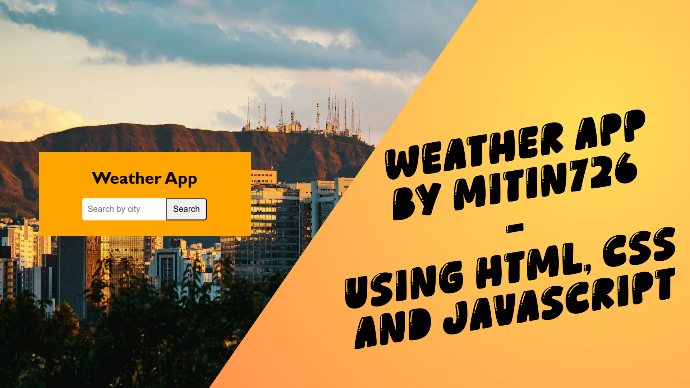

# Weather App 🌤️

<!-- Add your banner image below -->


## About

A simple and clean weather application built with **HTML**, **CSS**, and **JavaScript** that lets you search for any city and get the current weather conditions, including temperature, humidity, wind speed, and a weather icon.

The background features the beautiful city of **Cali, Colombia** — my favorite city in my country. 🇨🇴

## ⚠️ Note about the GitHub Pages Deploy

The live deployment on GitHub Pages **will not be able to search for cities** because the `config.js` file containing the OpenWeather API key is not included in the repository for security reasons. To fully experience the app, please follow the instructions below to run it locally.

## How to Run Locally

1. **Get an API Key**
   - Go to [OpenWeatherMap](https://openweathermap.org/api) and sign up for a free account.
   - Generate an API key from your dashboard.

2. **Configure the project**
   - Rename the file `config.example.js` to `config.js`.
   - Open `config.js` and replace `"YOUR Api key from OpenWeather here..."` with your actual API key:
     ```js
     const openWeatherKey = "your-api-key-here";
     ```

3. **Open the app**
   - Simply open `index.html` in your browser and start searching for cities!

## Acknowledgments

A huge thank you to **Brandon Dusch** for the detailed tutorial that guided this mini-project. You can check it out here:

🔗 [View Weather with HTML, CSS & JS — Codedex](https://www.codedex.io/projects/view-weather-with-html-css-js)

---

Made with ❤️ by Mitin726
